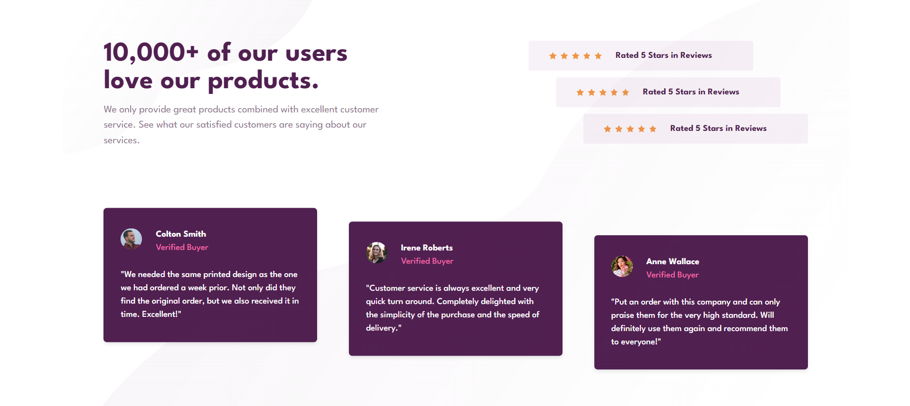

# Frontend Mentor - Social proof section solution

This is a solution to the [Social proof section challenge on Frontend Mentor](https://www.frontendmentor.io/challenges/social-proof-section-6e0qTv_bA). Frontend Mentor challenges help you improve your coding skills by building realistic projects.

## Table of contents

- [Screenshot](#screenshot)
- [Built with](#built-with)
- [What I learned](#what-i-learned)
- [Author](#author)

### Screenshot

- Live Site URL: ()

### Built with

- Semantic HTML5 markup
- CSS3
- Responsiveness

### What I learned

- Responsive layouts with media queries
- Placing items with position absolute and using the transform property
- Semantic HTML5 Markup

## Author

- LinkedIn - [Muhammad Raza](https://www.linkedin.com/in/frontend-developer-muhammad-raza/)
- Frontend Mentor - [@illusiveCode](https://www.frontendmentor.io/profile/illusiveCode)

### Thanks for reading!
